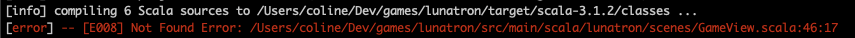

## Ekans the shadow of Snake

The game we want to build is a 2 player one with 2 snakes.

For the second snake we will need another instantiation of Snake

we will call it Ekans :)

We want to keep both of them in a **Tron** case class so we can define common methods.

### 1. Tron model

Create an empty `tronmodel` directory just like `snakemodel` one, in `model` directory

Create `Tron` case class that contains Snake and Ekans

```scala
final case class Tron(snake: Snake, ekans: Snake)
```

Add `Tron` object and define `apply` methods. 

You can take a look at the `Snake` one because we will basically be instantiating 2 snakes in here.

```scala
object Tron {
  def apply(start: Vertex): Tron =
    Tron(
      Snake(start, Nil, SnakeDirection.Up, SnakeStatus.Alive),
      Snake(start, Nil, SnakeDirection.Down, SnakeStatus.Alive) 
    )

  def apply(x: Int, y: Int): Tron =
    Tron(
      Snake(Vertex(x.toDouble, y.toDouble), Nil, SnakeDirection.Up, SnakeStatus.Alive),
      Snake(Vertex(x.toDouble, y.toDouble), Nil, SnakeDirection.Down, SnakeStatus.Alive)
    )

}
```

Add the necessary imports

```scala
import indigoextras.geometry.Vertex
import lunatron.model.snakemodel.{Snake, SnakeDirection, SnakeStatus}
```

### 2. Game model

As mentioned previously the `GameModel` class is where the magic happens.

It defines how the game will be updated during time responding to different events and interactions.

`Snake` is part of the `GameModel`, we could add `Ekans` here but this is the reason why we created `Tron`.  

So replace `Snake` with the new `Tron` one.

```scala
final case class GameModel(
    tron: Tron,
    gameState: GameState,
    gameMap: GameMap,
    score: Int,
    tickDelay: Seconds,
    controlScheme: ControlScheme,
    lastUpdated: Seconds
)
```

Now we have to update **Snake** usages in `GameModel` one by one, replace them by **Tron** and adapt the code.

- `initialModel`

  This function initialise the model so instead of an implementation of **snake** we want an implementation of **Tron** here by calling the `apply` function.
  
    ```scala
    tron = Tron(
            gridSize.center.x.toInt,
            gridSize.center.y.toInt - (gridSize.center.y / 2).toInt
          ),
    ```

    Don't forget to remove the `.grow.grow` as this will make snakes too large at start


- `updateRunning` `case FrameTick`
  
  `updateRunning` will define what happen on `FrameTick` or `KeyboardEvent`

  In case of `FrameTick` we want to update the model with all new information.
  
    ```scala
    val (updatedModel, collisionResult) =
      state.tron.update(state.gameMap.gridSize, hitTest(state.gameMap, state.tron.givePath)) match {
        case (t, outcome) =>
          (
            state.copy(tron = t, gameState = state.gameState.updateNow(gameTime.running, state.tron.direction)),
            outcome
          )
      }
    ```

  Notice that `tron.givePath` and `tron.direction` don’t really make sense, but we will update that in a moment.

  We will create an `update` function for `Tron`.

  But first, if you take a look at the `Snake` `update` function you'll see that it returns a `CollisionCheckOutcome`
  
  This collision model can only apply to **one** Snake so we need another one that will take both into account.
  
  Create `CollisionCheckResult` in `tronmodel` to handle Snake and Ekans `CollisionCheckOutcomes`

    ```scala
    import lunatron.model.snakemodel.CollisionCheckOutcome
    
    sealed trait CollisionCheckResult {
      val result: CollisionCheckOutcome
    }
    object CollisionCheckResult {
      final case class BothNoCollision(snake: CollisionCheckOutcome.NoCollision, ekans: CollisionCheckOutcome.NoCollision)
          extends CollisionCheckResult { val result = snake }
      final case class SnakePickUp(result: CollisionCheckOutcome.PickUp) extends CollisionCheckResult
      final case class EkansPickUp(result: CollisionCheckOutcome.PickUp) extends CollisionCheckResult
      final case class SnakeCrashed(result: CollisionCheckOutcome.Crashed) extends CollisionCheckResult
      final case class EkansCrashed(result: CollisionCheckOutcome.Crashed) extends CollisionCheckResult
    
      def fromCollisionCheckOutcomes(snakeCollision: CollisionCheckOutcome, ekansCollision: CollisionCheckOutcome) =
        (snakeCollision, ekansCollision) match {
          case (s: CollisionCheckOutcome.NoCollision, e: CollisionCheckOutcome.NoCollision) => BothNoCollision(s, e)
          case (s: CollisionCheckOutcome.Crashed, _)                                        => SnakeCrashed(s)
          case (_, e: CollisionCheckOutcome.Crashed)                                        => EkansCrashed(e)
          case (s: CollisionCheckOutcome.PickUp, _)                                         => SnakePickUp(s)
          case (_, e: CollisionCheckOutcome.PickUp)                                         => EkansPickUp(e)
        }
    }
    ```

  Now we need to add to `Tron` an `update` method that returns this `CollisionCheckResult`

    ```scala
    // In the object :
    def update(
          tron: Tron,
          gridSize: BoundingBox,
          snakeCollisionCheck: Vertex => CollisionCheckOutcome,
          ekansCollisionCheck: Vertex => CollisionCheckOutcome
      ): (Tron, CollisionCheckResult) = {
        val s = tron.snake.update(gridSize, snakeCollisionCheck)
        val e = tron.ekans.update(gridSize, ekansCollisionCheck)
        (Tron(s._1, e._1), CollisionCheckResult.fromCollisionCheckOutcomes(s._2, e._2))
      }
  
  // In the case class :
  def update(gridSize: BoundingBox,
             snakeCollisionCheck: Vertex => CollisionCheckOutcome,
             ekansCollisionCheck: Vertex => CollisionCheckOutcome): (Tron, CollisionCheckResult) =
       Tron.update(this, gridSize, snakeCollisionCheck, ekansCollisionCheck)
    ```

  Then, back to `GameModel`, in `tron.update`, we want to call `hitTest` method on both snake and ekans.
  
  And when `tron.direction` is called in `updateNow` we actually want here both Snake and Ekans directions.

    ```scala
    val (updatedModel, collisionResult) =
        state.tron.update(
                state.gameMap.gridSize, 
                hitTest(state.gameMap, state.tron.snake.givePath),
          hitTest(state.gameMap, state.tron.ekans.givePath)
            ) match {
          case (t, outcome) =>
            (
              state.copy(
                            tron = t, 
                            gameState = state.gameState.updateNow(
                                gameTime.running, 
                                state.tron.snake.direction,
                                state.tron.ekans.direction
                            )
                        ),
              outcome
            )
        }
    ```

  We will add the ekans direction info in `GameState` later


- `updateRunning` `case e: KeyboardEvent`

  In case of `KeyboardEvent` we want to apply related action. In this case it will consist in instructing snake and ekans to move in a certain direction.
  
    ```scala
    case e: KeyboardEvent =>
          Outcome(
            state.copy(
              tron = Tron(
                state.controlScheme.instructSnake(e, state.tron.snake, runningDetails.lastSnakeDirection),
                state.controlScheme.instructSnake(e, state.tron.ekans, runningDetails.lastEkansDirection)
              )
            )
          )
    ```

  Same than above, we will add the `lastEkansDirection` info in `GameState` later


- `updateBasedOnCollision`

  Collision is now defined using `CollisionCheckResult` instead of `CollisionCheckOutcome`

  Update definition with it

    ```scala
    def updateBasedOnCollision(
          gameTime: GameTime,
          dice: Dice,
          gridSquareSize: Int,
          gameModel: GameModel,
          collisionResult: CollisionCheckResult
      ): Outcome[GameModel] =
    ```

- `updateBasedOnCollision` `case CollisionCheckOutcome.Crashed(_)`

  That `Crashed` case only works for Snake game. We want to be able to know if Snake **or** Ekans Crashed.

  Let’s match on `CollisionCheckResult` cases starting with `SnakeCrashed`

    ```scala
    case CollisionCheckResult.SnakeCrashed(_) =>
            Outcome(
              gameModel.copy(
                gameState = gameModel.gameState match {
                  case c @ GameState.Crashed(_, _, _, _) =>
                    c
    
                  case r @ GameState.Running(_, _) =>
                    r.crash(gameTime.running, gameModel.tron.snake.length)
                },
                tickDelay = gameModel.tron.snake.length match {
                  case l if l < 5  => Seconds(0.1)
                  case l if l < 10 => Seconds(0.05)
                  case l if l < 25 => Seconds(0.025)
                  case _           => Seconds(0.015)
                }
              )
            ).addGlobalEvents(PlaySound(GameAssets.soundLose, Volume.Max))
    ```

  Now we can do the same for `EkansCrashed` case

    ```scala
    case CollisionCheckResult.EkansCrashed(_) =>
            Outcome(
              gameModel.copy(
                gameState = gameModel.gameState match {
                  case c @ GameState.Crashed(_, _, _, _) =>
                    c
    
                  case r @ GameState.Running(_, _) =>
                    r.crash(gameTime.running, gameModel.tron.ekans.length)
                },
                tickDelay = gameModel.tron.ekans.length match {
                  case l if l < 5  => Seconds(0.1)
                  case l if l < 10 => Seconds(0.05)
                  case l if l < 25 => Seconds(0.025)
                  case _           => Seconds(0.015)
                }
              )
            ).addGlobalEvents(PlaySound(GameAssets.soundLose, Volume.Max))
    ```

- `updateBasedOnCollision` `CollisionCheckOutcome.PickUp(pt)`

  Same than above we want to know if Snake **or** Ekans picked up

  Change that case to `SnakePickUp`

    ```scala
    case CollisionCheckResult.SnakePickUp(collision) =>
            Outcome(
              gameModel.copy(
                tron = Tron(
                  gameModel.tron.snake.grow,
                  gameModel.tron.ekans
                ),
                gameMap = gameModel.gameMap
                  .removeApple(collision.gridPoint)
                  .insertApple(
                    MapElement.Apple(
                      gameModel.gameMap.findEmptySpace(dice, collision.gridPoint :: gameModel.tron.snake.givePath)
                    )
                  ),
                score = gameModel.score + ScoreIncrement
              )
            ).addGlobalEvents(
              PlaySound(GameAssets.soundPoint, Volume.Max),
              Score.spawnEvent(GameView.gridPointToPoint(collision.gridPoint, gameModel.gameMap.gridSize, gridSquareSize))
            )
    ```

  And do the same for `EkansPickUp`

    ```scala
    case CollisionCheckResult.EkansPickUp(collision) =>
            Outcome(
              gameModel.copy(
                tron = Tron(
                  gameModel.tron.snake,
                  gameModel.tron.ekans.grow
                ),
                gameMap = gameModel.gameMap
                  .removeApple(collision.gridPoint)
                  .insertApple(
                    MapElement.Apple(
                      gameModel.gameMap.findEmptySpace(dice, collision.gridPoint :: gameModel.tron.ekans.givePath)
                    )
                  ),
                score = gameModel.score + ScoreIncrement
              )
            ).addGlobalEvents(
              PlaySound(GameAssets.soundPoint, Volume.Max),
              Score.spawnEvent(GameView.gridPointToPoint(collision.gridPoint, gameModel.gameMap.gridSize, gridSquareSize))
            )
    ```

  To make it more readable we will add `growSnake` and `growEkans` to `Tron` model

    ```scala
    // in the object
    def growSnake(tron: Tron) = tron.copy(snake = tron.snake.grow)
    
    def growEkans(tron: Tron) = tron.copy(ekans = tron.ekans.grow)
    
    // in the class
    val growSnake = Tron.growSnake(this)
    
    val growEkans = Tron.growEkans(this)
    ```

  Use it in previously updated code

    ```scala
    case CollisionCheckResult.SnakePickUp(pt) =>
            Outcome(
              gameModel.copy(
                tron = gameModel.tron.growSnake
    /***/
    case CollisionCheckResult.EkansPickUp(pt) =>
            Outcome(
              gameModel.copy(
                tron = gameModel.tron.growEkans,
    ```

- `updateBasedOnCollision` `CollisionCheckOutcome.NoCollision`

  Update `NoCollision` case with `BothNoCollision` one from `CollisionCheckResult`

    ```scala
    case CollisionCheckResult.BothNoCollision(_, _) =>
            Outcome(gameModel)
    ```

- `updateCrashed` `case FrameTick if length > 1`

  Same than above we want to duplicate match cases, one for snake and one for ekans.

  First we can add `Shrink` methods to `Tron` model

    ```scala
    // in the object
    def shrinkSnake(tron: Tron) = tron.copy(snake = tron.snake.shrink)
    
    def shrinkEkans(tron: Tron) = tron.copy(ekans = tron.ekans.shrink)
    
    // in the class
    val shrinkSnake = Tron.shrinkSnake(this)
    
    val shrinkEkans = Tron.shrinkEkans(this)
    ```

  Then replace that case with two cases, one for Snake and one for Ekans

    ```scala
    case FrameTick if state.tron.snake.length > 1 =>
      Outcome(
        state.copy(
          tron = state.tron.shrinkSnake,
          gameState = state.gameState
            .updateNow(gameTime.running, state.gameState.lastSnakeDirection, state.gameState.lastEkansDirection)
        )
      )
    
    case FrameTick if state.tron.ekans.length > 1 =>
      Outcome(
        state.copy(
          tron = state.tron.shrinkEkans,
          gameState = state.gameState
            .updateNow(gameTime.running, state.gameState.lastSnakeDirection, state.gameState.lastEkansDirection)
        )
      )
    ```

- `updateCrashed` `case FrameTick if length == 1`

  Duplicate and adapt for snake and ekans

    ```scala
    case FrameTick if state.tron.snake.length == 1 =>
          Outcome(state).addGlobalEvents(SceneEvent.JumpTo(GameOverScene.name))
    
    case FrameTick if state.tron.ekans.length == 1 =>
      Outcome(state).addGlobalEvents(SceneEvent.JumpTo(GameOverScene.name))
    ```
### 3. Game state

During the modification of `GameModel` we noticed that `GameState` also needed adjustments

First, in the base trait, let’s add info about last and current direction for both Snake and Ekans.

```scala
sealed trait GameState {
  val hasCrashed: Boolean
  val lastSnakeDirection: SnakeDirection
  val lastEkansDirection: SnakeDirection
  def updateNow(time: Seconds, currentSnakeDirection: SnakeDirection, currentEkansDirection: SnakeDirection): GameState
}
```

Now let’s update implementations just like we did before.

- case class `Crashed`

  Add `lastEkansDirection` to definition and adapt `updateNow` function

    ```scala
    final case class Crashed(
          crashedAt: Seconds,
          snakeLengthOnCrash: Int,
          lastUpdated: Seconds,
          lastSnakeDirection: SnakeDirection,
          lastEkansDirection: SnakeDirection
      ) extends GameState {
        val hasCrashed: Boolean = true
    
        def updateNow(time: Seconds, currentSnakeDirection: SnakeDirection, currentEkansDirection: SnakeDirection): GameState.Crashed =
          this.copy(lastUpdated = time, lastSnakeDirection = currentSnakeDirection, lastEkansDirection = currentEkansDirection)
      }
    ```

- case class `Running`

  Add `lastEkansDirection` to definition and adapt `updateNow` and `crash` functions

    ```scala
    final case class Running(
        lastUpdated: Seconds, 
        lastSnakeDirection: SnakeDirection, 
        lastEkansDirection: SnakeDirection
      ) extends GameState {
        val hasCrashed: Boolean = false
    
        def updateNow(time: Seconds, currentSnakeDirection: SnakeDirection, currentEkansDirection: SnakeDirection): GameState.Running =
          this.copy(lastUpdated = time, lastSnakeDirection = currentSnakeDirection, lastEkansDirection = currentEkansDirection)
    
        def crash(crashedAt: Seconds, snakeLengthOnCrash: Int): GameState.Crashed =
          GameState.Crashed(crashedAt, snakeLengthOnCrash: Int, lastUpdated, lastSnakeDirection, lastEkansDirection)
      }
    ```

- object `Running`

    ```scala
    object Running {
        val start: Running = GameState.Running(Seconds.zero, SnakeDirection.Up, SnakeDirection.Down)
      }
    ```
  
Finally, let's go back to `GameModel` to update the usages of what we just modified.

Update all `GameState.Running(_, _)` with `GameState.Running(_, _, _)`

and all `GameState.Crashed(_, _, _, _)` with `GameState.Crashed(_, _, _, _, _)`

---

At that point it seems that we have modified everything related to the adding of **Tron** object to `GameModel`

Let’s run a `sbt buildGame` to see what it says



We have introduced an error in the `GameView` so let’s take a look at it.

### 4. Game view

As I mentioned previously scenes represent all the "windows" the game will go through with the interactions or actions needed to pass from one to the other.

It can be represented as a simple graph

    StartScene → *hit space* → ControlScene → *hit space* →

      GameScene → *crashed* → GameOverScene
                → *run*     → GameScene


`GameView` defines element that appear in the `GameScene`.

First thing we notice is that it describes a list of things to draw on the screen.
This is a list of `SceneNodes` which are the root constructors of scenes. 
They can be associated, added and layered to build the view of the game.

```scala
walls ::
	drawApple(viewConfig, currentState.gameMap, staticAssets) ++
  drawSnake(viewConfig, currentState, staticAssets.snake) ++
  drawScore(viewConfig, currentState.score)
```

We will need to also draw Ekans, which means we need to create a `drawEkans` function

First let’s fix and update the `drawSnake` one

```scala
def drawSnake(viewConfig: ViewConfig, currentState: GameModel, snakeAsset: Graphic[_]): List[Graphic[_]] =
    currentState.tron.snake.givePath.map { pt =>
      snakeAsset.moveTo(gridPointToPoint(pt, currentState.gameMap.gridSize, viewConfig.gridSquareSize))
    }
```

Then duplicate it to create `drawEkans`

```scala
def drawEkans(viewConfig: ViewConfig, currentState: GameModel, ekansAsset: Graphic[_]): List[Graphic[_]] =
    currentState.tron.ekans.givePath.map { pt =>
      ekansAsset.moveTo(gridPointToPoint(pt, currentState.gameMap.gridSize, viewConfig.gridSquareSize))
    }
```

We can now add it to the list of `SceneNodes`

```scala
walls ::
      drawApple(viewConfig, currentState.gameMap, staticAssets) ++
      drawSnake(viewConfig, currentState, staticAssets.snake) ++
      drawEkans(viewConfig, currentState, staticAssets.snake) ++
      drawScore(viewConfig, currentState.score)
```

Let’s compile again

It should work 😄

Go to build directory `cd target/indigoBuild`

Start the server `http-server -c-1`

and try the game.
