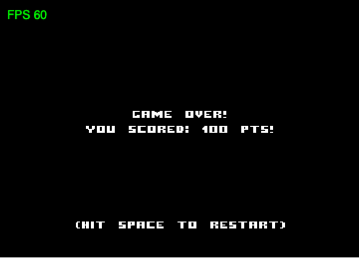
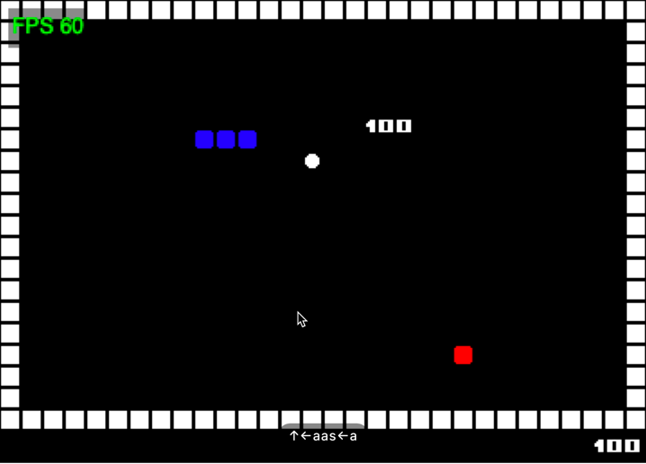

## Scores

Right now whoever of snake or ekans eat an apple the score is incremented and doesn't belong to any player.

In fact `Score` is part of `GameModel` class and represented with an `Int`.

In order to split it between snake one and ekans one, we could make it part of `Snake` model like we did for `controlScheme`. But it makes less sense in that case.

For that one we could try to model it differently and keep it part of `GameModel`.

In fact scores appear in two places in the code

When game over



And during the game, above the apple when picked, which will not change at all. And in the bottom right corner of the screen.



In both cases this modelling should allow us to duplicate it easily.

Start by creating a `Score` model in `tronmodel` that define both snake and ekans ones.

```scala
package lunatron.model.tronmodel

case class Scores(
    snake: Int,
    ekans: Int
)
```

Use it in `GameModel` instead of the Int

```scala
final case class GameModel(
  tron: Tron,
  gameState: GameState,
  gameMap: GameMap,
  scores: Scores,
  tickDelay: Seconds,
  lastUpdated: Seconds
)
```

Now update its initialisation in `initialModel` with both of them to 0

```scala
def initialModel(gridSize: BoundingBox): GameModel =
	GameModel(
	  tron = Tron(
	    gridSize.center.x.toInt,
	    gridSize.center.y.toInt - (gridSize.center.y / 2).toInt
	  ),
	  gameState = GameState.Running.start,
	  gameMap = GameMap.genLevel(gridSize),
	  scores = Scores(0, 0),
	  tickDelay = Seconds(0.1),
	  lastUpdated = Seconds.zero
	)
```

In `updateBasedOnCollision` if snake `pickUp` we want to increase snake points and if ekans `pickUp` then we want to increase ekans points.

```scala
???
```

You can model a score increment function in `Scores` if you have time, like we did for `growSnake`.

This will do it for the modeling.

Now we need to update the scenes.

Final scores appears in `GameOverScene`, open it.

As mentioned above we want to show both scores here.

Let’s start with modifying the type of `SceneModel`

```scala
type SceneModel = Scores
```

Update `modelLens`

```scala
val modelLens: Lens[GameModel, SceneModel] =
    Lens.readOnly(_.scores)
```

In `updateModel` update the parameter and the outcome type

```scala
def updateModel(context: FrameContext[StartupData], pointsScored: Scores): GlobalEvent => Outcome[SceneModel] = {
    case KeyboardEvent.KeyUp(Key.SPACE) =>
      Outcome(pointsScored).addGlobalEvents(SceneEvent.JumpTo(StartScene.name))

    case _ =>
      Outcome(pointsScored)
  }
```

Same for `updateViewModel`

```scala
def updateViewModel(
      context: FrameContext[StartupData],
      pointsScored: Scores,
      sceneViewModel: SceneViewModel
  ): GlobalEvent => Outcome[SceneViewModel] =
    _ => Outcome(sceneViewModel)
```

And same for `present`

```scala
def present(
      context: FrameContext[StartupData],
      pointsScored: Scores,
      sceneViewModel: SceneViewModel
  ): Outcome[SceneUpdateFragment] =
```

Now in the content of `present` we want to show both scores

```scala
SceneUpdateFragment.empty.addLayer(
        Layer(
          BindingKey("ui"),
          Text(
            "Game Over!",
            horizontalCenter,
            verticalMiddle - 40,
            1,
            GameAssets.fontKey,
            GameAssets.fontMaterial
          ).alignCenter,
          Text(
            s"Snake scored: ${pointsScored.snake.toString()} pts!",
            horizontalCenter,
            verticalMiddle - 20,
            1,
            GameAssets.fontKey,
            GameAssets.fontMaterial
          ).alignCenter,
          Text(
            s"Ekans scored: ${pointsScored.ekans.toString()} pts!",
            horizontalCenter,
            verticalMiddle,
            1,
            GameAssets.fontKey,
            GameAssets.fontMaterial
          ).alignCenter,
          Text(
            "(hit space to restart)",
            horizontalCenter,
            220,
            1,
            GameAssets.fontKey,
            GameAssets.fontMaterial
          ).alignCenter
        )
      )
```

Score also appears in the bottom right corner during the game which corresponds to `GameView`

There's a dedicated `drawScore` function.

What we want to do here is to show 
* in bottom right corner Snake’s points in Blue 
* in bottom left corner Ekans’ points in Red.

```scala
???
```

I let you implement that part on your own !
