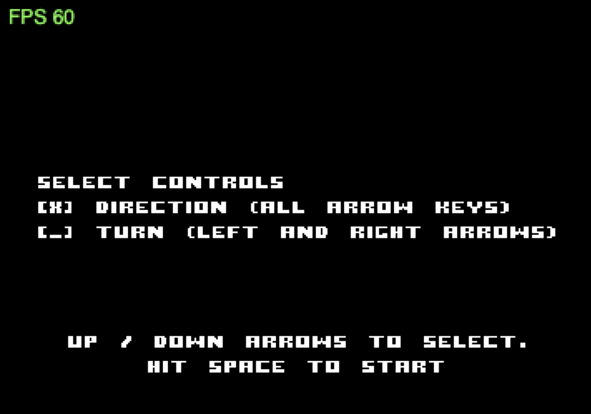

## Control Ekans with WASD

Our previous modifications work pretty well

We’ve got two snakes that can move, eat, grow and die

But we have an issue with the controls as arrow keys control both snakes

We would like to introduce a new set of controls with WASD to control ekans

Let’s go back to our entry point : `GameModel`

In the `updateRunning` function we’ve got a case that capture a keyboard event and instruct snake. This seems to be the good place to instruct with another set of controls.

Let’s take a look at `ControlScheme`

This is where the matching between the arrow keys and the direction given to snake is made.

We want to update that to instruct Ekans using WASD control keys

First add WASD elements to object

```scala
object ControlScheme {
  final case class Turning(left: Key, right: Key) extends ControlScheme
  final case class WASDTurning(left: Key, right: Key) extends ControlScheme
  final case class Directed(up: Key, down: Key, left: Key, right: Key) extends ControlScheme
  final case class WASDDirected(up: Key, down: Key, left: Key, right: Key) extends ControlScheme

  val turningKeys: Turning = Turning(Key.LEFT_ARROW, Key.RIGHT_ARROW)
  val wasdTurningKeys: WASDTurning = WASDTurning(Key.KEY_A, Key.KEY_D)
  val directedKeys: Directed = Directed(Key.UP_ARROW, Key.DOWN_ARROW, Key.LEFT_ARROW, Key.RIGHT_ARROW)
  val wasdDirectedKeys: WASDDirected = WASDDirected(Key.KEY_W, Key.KEY_S, Key.KEY_A, Key.KEY_D)
}
```

Update `swap`

```scala
def swap: ControlScheme =
  this match {
    case ControlScheme.Turning(_, _) =>
      ControlScheme.directedKeys

    case ControlScheme.Directed(_, _, _, _) =>
      ControlScheme.turningKeys

    case ControlScheme.WASDTurning(_, _) =>
      ControlScheme.directedKeys

    case ControlScheme.WASDDirected(_, _, _, _) =>
      ControlScheme.turningKeys
  }
```

Update `instructSnake`

```scala
def instructSnake(keyboardEvent: KeyboardEvent, snake: Snake, currentDirection: SnakeDirection): Snake =
    (this, keyboardEvent) match {
      case (ControlScheme.Turning(left, _), KeyboardEvent.KeyDown(code)) if code === left =>
        currentDirection.makeLegalTurn(snake.turnLeft).getOrElse(snake)

      case (ControlScheme.Turning(_, right), KeyboardEvent.KeyDown(code)) if code === right =>
        currentDirection.makeLegalTurn(snake.turnRight).getOrElse(snake)

      case (ControlScheme.Directed(up, _, _, _), KeyboardEvent.KeyDown(code)) if code === up =>
        currentDirection.makeLegalTurn(snake.goUp).getOrElse(snake)

      case (ControlScheme.Directed(_, down, _, _), KeyboardEvent.KeyDown(code)) if code === down =>
        currentDirection.makeLegalTurn(snake.goDown).getOrElse(snake)

      case (ControlScheme.Directed(_, _, left, _), KeyboardEvent.KeyDown(code)) if code === left =>
        currentDirection.makeLegalTurn(snake.goLeft).getOrElse(snake)

      case (ControlScheme.Directed(_, _, _, right), KeyboardEvent.KeyDown(code)) if code === right =>
        currentDirection.makeLegalTurn(snake.goRight).getOrElse(snake)

      case (ControlScheme.WASDTurning(left, _), KeyboardEvent.KeyDown(code)) if code === left =>
        currentDirection.makeLegalTurn(snake.turnLeft).getOrElse(snake)

      case (ControlScheme.WASDTurning(_, right), KeyboardEvent.KeyDown(code)) if code === right =>
        currentDirection.makeLegalTurn(snake.turnRight).getOrElse(snake)

      case (ControlScheme.WASDDirected(up, _, _, _), KeyboardEvent.KeyDown(code)) if code === up =>
        currentDirection.makeLegalTurn(snake.goUp).getOrElse(snake)

      case (ControlScheme.WASDDirected(_, down, _, _), KeyboardEvent.KeyDown(code)) if code === down =>
        currentDirection.makeLegalTurn(snake.goDown).getOrElse(snake)

      case (ControlScheme.WASDDirected(_, _, left, _), KeyboardEvent.KeyDown(code)) if code === left =>
        currentDirection.makeLegalTurn(snake.goLeft).getOrElse(snake)

      case (ControlScheme.WASDDirected(_, _, _, right), KeyboardEvent.KeyDown(code)) if code === right =>
        currentDirection.makeLegalTurn(snake.goRight).getOrElse(snake)

      case _ => snake
    }
```

`instructSnake` is snake related and `ControlScheme` is part of `GameModel`. This does not make sense anymore in our model, because each snake should have its own `ControlScheme`. We should be able to apply one of the control scheme to one of the snake. For this to be possible it all has to be part of `Snake` model.

Remove `ControlScheme` from `GameModel`

```scala
final case class GameModel(
    tron: Tron,
    gameState: GameState,
    gameMap: GameMap,
    score: Int,
    tickDelay: Seconds,
    lastUpdated: Seconds
) {
```

and update `initialModel` definition

```scala
def initialModel(gridSize: BoundingBox): GameModel =
	GameModel(
      tron = Tron(
        gridSize.center.x.toInt,
        gridSize.center.y.toInt - (gridSize.center.y / 2).toInt
      ),
      gameState = GameState.Running.start,
      gameMap = GameMap.genLevel(gridSize),
      score = 0,
      tickDelay = Seconds(0.1),
      lastUpdated = Seconds.zero
    )
```

This function is called in `LunatronGame` update the calls

```scala
def initialModel(startupData: StartupData): Outcome[GameModel] =
    Outcome(GameModel.initialModel(startupData.viewConfig.gridSize))

// and 

def updateModel(context: FrameContext[StartupData], model: GameModel): GlobalEvent => Outcome[GameModel] = {
  case GameReset =>
    Outcome(GameModel.initialModel(context.startUpData.viewConfig.gridSize))
```

Now add `ControlScheme` to `Snake`

```scala
final case class Snake(
    start: Vertex,
    body: List[Vertex],
    direction: SnakeDirection,
    status: SnakeStatus,
    controlScheme: ControlScheme
) {
```

Update `Snake` `apply` functions

```scala
def apply(start: Vertex, controlScheme: ControlScheme): Snake =
    Snake(start, Nil, SnakeDirection.Up, SnakeStatus.Alive, controlScheme)

  def apply(x: Int, y: Int, controlScheme: ControlScheme): Snake =
    Snake(Vertex(x.toDouble, y.toDouble), Nil, SnakeDirection.Up, SnakeStatus.Alive, controlScheme)
```

And `Snake` `moveToPosition` function

```scala
def moveToPosition(snake: Snake, snakePoint: Vertex): Snake =
    snake match {
      case Snake(_, Nil, d, s, cs) =>
        Snake(snakePoint, Nil, d, s, cs)

      case Snake(h, l, d, s, cs) =>
        Snake(snakePoint, h :: l.reverse.drop(1).reverse, d, s, cs)
    }
```

Then update `Tron` `apply` function and give **directed keys** to snake and **WASD directed keys** to ekans

```scala
def apply(x: Int, y: Int): Tron =
    Tron(
			Snake(
        Vertex(x.toDouble, y.toDouble), 
        Nil, 
        SnakeDirection.Up, 
        SnakeStatus.Alive, 
        ControlScheme.directedKeys
      ),
      Snake(
        Vertex(x.toDouble, y.toDouble),
        Nil,
        SnakeDirection.Down,
        SnakeStatus.Alive,
        ControlScheme.wasdDirectedKeys
      )
)
```

Move `instructSnake` into `Snake` and rename it `instruct`, snake direction and control scheme are now induced by snake.

```scala
def instruct(keyboardEvent: KeyboardEvent, snake: Snake): Snake =
(snake.controlScheme, keyboardEvent) match {
  case (ControlScheme.Turning(left, _), KeyboardEvent.KeyDown(code)) if code === left =>
    snake.direction.makeLegalTurn(snake.turnLeft).getOrElse(snake)

  case (ControlScheme.Turning(_, right), KeyboardEvent.KeyDown(code)) if code === right =>
    snake.direction.makeLegalTurn(snake.turnRight).getOrElse(snake)

  case (ControlScheme.Directed(up, _, _, _), KeyboardEvent.KeyDown(code)) if code === up =>
    snake.direction.makeLegalTurn(snake.goUp).getOrElse(snake)

  case (ControlScheme.Directed(_, down, _, _), KeyboardEvent.KeyDown(code)) if code === down =>
    snake.direction.makeLegalTurn(snake.goDown).getOrElse(snake)

  case (ControlScheme.Directed(_, _, left, _), KeyboardEvent.KeyDown(code)) if code === left =>
    snake.direction.makeLegalTurn(snake.goLeft).getOrElse(snake)

  case (ControlScheme.Directed(_, _, _, right), KeyboardEvent.KeyDown(code)) if code === right =>
    snake.direction.makeLegalTurn(snake.goRight).getOrElse(snake)

  case (ControlScheme.WASDTurning(left, _), KeyboardEvent.KeyDown(code)) if code === left =>
    snake.direction.makeLegalTurn(snake.turnLeft).getOrElse(snake)

  case (ControlScheme.WASDTurning(_, right), KeyboardEvent.KeyDown(code)) if code === right =>
    snake.direction.makeLegalTurn(snake.turnRight).getOrElse(snake)

  case (ControlScheme.WASDDirected(up, _, _, _), KeyboardEvent.KeyDown(code)) if code === up =>
    snake.direction.makeLegalTurn(snake.goUp).getOrElse(snake)

  case (ControlScheme.WASDDirected(_, down, _, _), KeyboardEvent.KeyDown(code)) if code === down =>
    snake.direction.makeLegalTurn(snake.goDown).getOrElse(snake)

  case (ControlScheme.WASDDirected(_, _, left, _), KeyboardEvent.KeyDown(code)) if code === left =>
    snake.direction.makeLegalTurn(snake.goLeft).getOrElse(snake)

  case (ControlScheme.WASDDirected(_, _, _, right), KeyboardEvent.KeyDown(code)) if code === right =>
    snake.direction.makeLegalTurn(snake.goRight).getOrElse(snake)

  case _ => snake
}
```

Add `instruct` in `Snake` trait

```scala
def instruct(keyboardEvent: KeyboardEvent): Snake =
    Snake.instruct(keyboardEvent, this)
```

Now we can update **keyboard event** case in `GameModel`

```scala
case e: KeyboardEvent =>
  Outcome(
    state.copy(tron = Tron(state.tron.snake.instruct(e), state.tron.ekans.instruct(e)))
  )
```

Let’s compile !

You’ll probably have an error with `ControlScene`
If you take a look at the game and at this particular scene



You’ll see that it does not really make sense in our new Tron game or we would have to duplicate it per player with wasd keys too…

What we could do instead is give a choice between Snake and Ekans and the set of keys the player want to use.

But that seems to be a nice to have.

So for now we will just update it to make it only descriptive on how to controls the snakes.

## Update Controls Scene

In `ControlsScene` file

`modelLens` is raising the error because of `controlScheme` which is no longer part of `GameModel.`

Replace its value with `Unit`.

```scala
type SceneModel = Unit

/*** and ***/

val modelLens: Lens[GameModel, Unit] =
    Lens.Unit
```

Let’s take a look at the `present` function. It has a list of `SceneNodes` that build the actual scene.

Remove the previous before last one that explains how to select

```scala
List(drawSelectText(horizontalCenter)) ++
```

Remove the `drawSelectText` function

```scala
def drawSelectText(center: Int): SceneNode =
    Text("Up / Down arrows to select.", center, 205, 1, GameAssets.fontKey, GameAssets.fontMaterial).alignCenter
```

And also the keyboard event case associated with it in `updateModel`

```scala
case KeyboardEvent.KeyUp(Key.UP_ARROW) | KeyboardEvent.KeyUp(Key.DOWN_ARROW) =>
      Outcome(controlScheme.swap)
```

In `updateModel` we will no longer return a `ControlScheme` choice so the outcome will become of type `SceneModel` which is `Unit`.

Modify `updateModel` and `updateViewModel` so they don’t take controlScheme as a parameter any more.

```scala
def updateModel(
      context: FrameContext[StartupData],
      sceneModel: SceneModel
  ): GlobalEvent => Outcome[SceneModel] = {
    case KeyboardEvent.KeyUp(Key.SPACE) =>
      Outcome(sceneModel).addGlobalEvents(SceneEvent.JumpTo(GameScene.name))
    case _ =>
      Outcome(sceneModel)
  }

  def updateViewModel(
      context: FrameContext[StartupData],
      sceneModel: SceneModel,
      sceneViewModel: SceneViewModel
  ): GlobalEvent => Outcome[SceneViewModel] =
    _ => Outcome(sceneViewModel)
```

Go back to `present` and replace `ControlScheme` type with `SceneModel` .

```scala
def present(
  context: FrameContext[StartupData],
  sceneModel: SceneModel,
  sceneViewModel: SceneViewModel
)
```

Then remove `ControlScheme` from `drawControlsText`

```scala
// in present
drawControlsText(24, verticalMiddle) ++

// and in the function
def drawControlsText(center: Int, middle: Int): List[SceneNode] =
```

In `drawControlsText` we want to explain that snake is the red one and is controlled with arrow keys and ekans is the blue one and is controlled with WASD keys.

We can safely remove the `controlScheme match {` part

And update and add elements to the list of text nodes (you can be more creative if you want )

```scala
List(
      Text("Tron controls:", center, middle - 60, 1, GameAssets.fontKey, GameAssets.fontMaterial).alignLeft,
      Text(
        "Snake, in Red",
        center,
        middle - 30,
        1,
        GameAssets.fontKey,
        GameAssets.fontMaterial
      ).alignLeft,
      Text(
        "is controlled with all arrow keys",
        center,
        middle - 20,
        1,
        GameAssets.fontKey,
        GameAssets.fontMaterial
      ).alignLeft,
      Text(
        "Ekans, in Blue",
        center,
        middle + 10,
        1,
        GameAssets.fontKey,
        GameAssets.fontMaterial
      ).alignLeft,
      Text(
        "is ontrolled with WASD keys",
        center,
        middle + 20,
        1,
        GameAssets.fontKey,
        GameAssets.fontMaterial
      ).alignLeft
    )
```

You can compile again and see what it looks like

Now you have a Tron ish game 😄

You can play with another person to try it !

Next step is fun

Let’s give them some colours ! 
