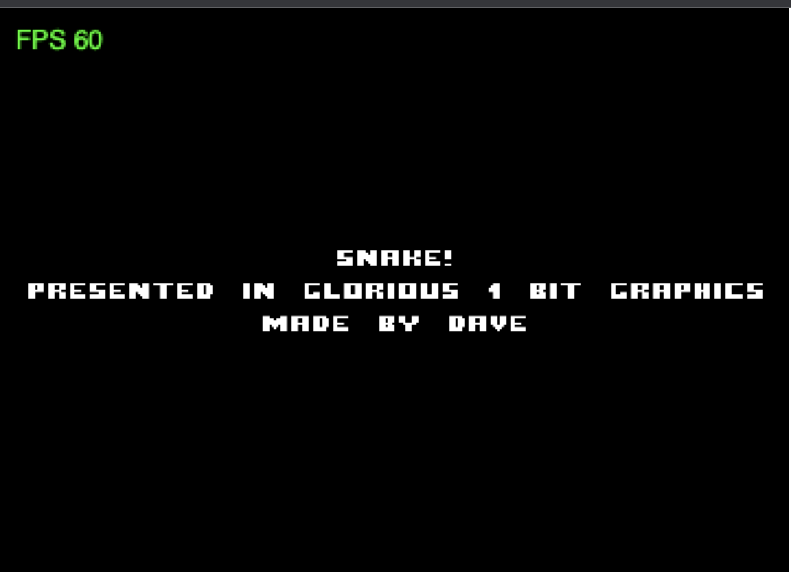

# Snake made by Dave

Dave is the creator of Indigo and one of it’s best contributor 😄

Here is the video where he presents indigo at “Scala in the city” :

[https://www.youtube.com/watch?v=SmZETGZKCVU](https://www.youtube.com/watch?v=SmZETGZKCVU)

He made some examples of games, like the one you can see in the video : “the cursed pirate”

But my favourite is Snake 🐍  I’ve always loved that game and played with it a lot on my foldable phone when I was younger !

Here you can find a zipped *sbt* version of it.

You can test it and play with it using

```bash
sbt buildGame
```

then

```bash
cd target/indigoBuild
http-server -c-1
```

Check [`http://127.0.0.1:8080/`](http://127.0.0.1:8080/)



Try and play with it !

# Tron upgrade

We want to use that Snake as a basis to build our own home made two players TRON game 🪢

We will basically duplicate snake, add another keys control, improve collision, update score calculation and add some colours 😅

This will allow us to go through the architecture of the code 🧅  and discover how Indigo let us easily build great games while coding in beautiful functional Scala 🌈

## Tron game and rules

There’s multiple versions of the TRON game, some with players launching some sort of rings other with bikes and finally some with snakes. The common point is that in any case the moving element will create a line/track behind it.

Our game will consist of two snakes evolving in a closed environment, the line will then be the snake itself.

It’s a two player game, each controlling one of the snakes, one with the arrows and the other with the WASD keys.

The rules that applies to a snake will still apply :

- if it cross a wall it dies
- if it cross itself it dies
- if it eat an apple it grows

The rule we will add to make it a **Tron** is :

- if it cross the other snake it dies

So the goal in order to win will be to cut the way to the other snake in order to force him to cross us or eventually to go into a wall or itself.

## The code structure

Let’s first make a little tour of the code structure.

First as we can expect from a game we have assets which contains mainly PNG and MP3.

In `src`

Let’s start with the  `init` folder where you’ll find `GameAssets` which basically allow handling them in a more typed way and `StartupData` which initialise assets and startup configuration.

Then at the root we have `LunatronGame` which is the entry point of the game. It extends `IndigoGame[ViewConfig, StartupData, GameModel, ViewModel]` and implements the related definitions.

In the `scenes` you’ll have each scene of the game with the text and any interaction needed to go from one scene to another.

And in the `model` you have the real work :) `GameModel` will be where we will mostly work, it describes all the conditions which will update the game and how.

Finally we have the `snakeModel` which describes **Snake** specifically and all the functions that applies to it.
